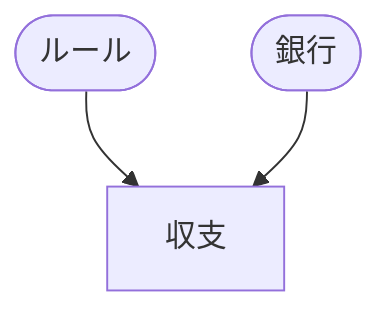

外部仕様書:データ構造
===========================

全体
-----



ルール
----

### 主体(`Entity`)
```json
{
    Id: 123,// Number,
    SortOrder: 1,// Number
    Name: "カテゴリ",// String,
    Memo: "説明",// String,
    Categories: [],// Category[],
    PresetEntityName: "PresetA:EntityB",// String | Null
    PresetArguments: [],// any[] | Null <-TODO: 色んな型があるので今はまだ決めきれない
}
```

### カテゴリ(`Category`)
```json
{
    Id: 456,// Number,
    SortOrder: 1,// Number
    Name: "カテゴリ",// String,
    Memo: "説明",// String,
    Events: [],// Event[],
    PresetCategoryName: "PresetA:EntityB:CategoryC",// String | Null
}
```

### 収支項目(`Event`)
```json
{
    Id: 789,// Number,
    SortOrder: 1,// Number
    Name: "イベント",// String,
    Memo: "説明",// String,
    Amount: 1000,// Number,
    Rules: [],// Rule[],
    PresetEventName: "PresetA:EntityB:CategoryC:EventD"//String | Null
}
```
### ルール(`Rule`)
1. 単年月:特定の年月に1回だけ発生する
   例）突発的な支出（等の記録）
    ```json
    {
        Type: "ONCE_YEARMONTHS",// String
        Not: false// Bool
        YearMonth: "2026-05",// String
        PresetRuleName: "PresetA:EntityB:CategoryC:EventD:Rule1"//String | Null
    }
    ```
1. 毎月：毎月発生する
   例）月給
    ```json
    {
        Type: "EVERY_MONTH",// String
        Not: false// Bool
        PresetRuleName: "PresetA:EntityB:CategoryC:EventD:Rule2"//String | Null
    }
    ```
1. 毎年[m]月：毎年特定の月（複数可）に発生する
   例）ボーナス
    ```json
    {
        Type: "SOME_MONTHS",// String
        Not: false //Bool
        Months: [5, 7, 9],// Number[]
        PresetRuleName: "PresetA:EntityB:CategoryC:EventD:Rule3"//String | Null
    }
    ```
1. y年ごと毎年[m]月：y年ごと特定の月（複数可）に発生する
   例）車検
    ```json
    {
        Type: "SOME_YEARMONTHS",// String
        Not: false //Bool
        StartYear: 2026,// Number,
        YearSteps: 2,// Number,
        Months: [5, 7, 9],// Number[]
        PresetRuleName: "PresetA:EntityB:CategoryC:EventD:Rule4"//String | Null
    }
    ```

### プリセット(`Preset`)
```json
{
    Id: 789,// Number,
    Name: "イベント",// String,
    Memo: "プリセット",// String,
    Entities: [{
        Id: 123,// Number,
        SortOrder: 1,// Number
        Name: "カテゴリ",// String,
        Memo: "説明",// String,
        Categories: [{
            Id: 456,// Number,
            SortOrder: 1,// Number
            Name: "カテゴリ",// String,
            Memo: "説明",// String,
            Events: [{
                Id: 789,// Number,
                SortOrder: 1,// Number
                Name: "イベント",// String,
                Memo: "説明",// String,
                Amount: 1000,// Number,
                Rules: [{
                    Type: "ONCE_YEARMONTHS",// String
                    Not: false// Bool
                    YearMonth: "2026-05",// String
                    PresetRuleName: "PresetA:EntityB:CategoryC:EventD:Rule1"//String | Null
                }],// Rule[],
                PresetEventName: "PresetA:EntityB:CategoryC:EventD"//String | Null
            }],// Event[],
            PresetCategoryName: "PresetA:EntityB:CategoryC",// String | Null
        }],// Category[],
        PresetEntityName: "PresetA:EntityB",// String | Null
    }],// Entity[],
    PresetName: "PresetA"//String | Null
}
```

### プリセット引数(`PresetArgumentHoge`)
```json
//TODO: 色んな型があるので今はまだ決めきれない
```

銀行
----


収支
----
