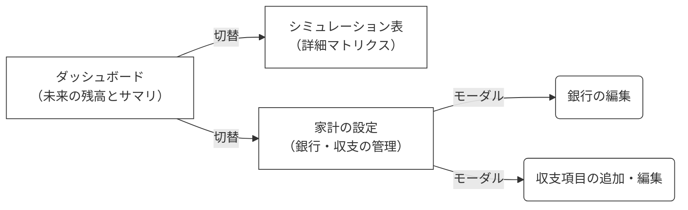

外部仕様書: UI
==================

本ドキュメントでは、ユーザーが最短で家計の未来（価値）に触れられるよう、データ構造を意識させないダッシュボード型のUX/UI仕様を定義する。

## 1. 画面構成と遷移
深い階層の画面遷移を廃止し、タブまたはサイドメニューで切り替えるSPA（Single Page Application）として構成する。

## 2. 画面定義

### 2-1. ダッシュボード (Home)
アプリを開いて一番最初に目に入る、未来の家計予測を可視化する画面。

- **メインビジュアル（チャート）**:
  - 各銀行の未来の残高推移を示すリッチな折れ線グラフを表示。
  - 残高がマイナス（ショート）する期間は警告色でハイライトする。
- **サマリパネル**:
  - 今月の予定収入、予定支出、差し引きの純増減額を表示。
- **Empty State (データが空の場合)**:
  - 銀行や収支イベントが1件も登録されていない初回アクセス時は、ぼかしたプレースホルダーグラフを背景に、「未来の家計を予測しよう」というメッセージと、設定画面へ誘導する大きなコールトゥアクション（CTA）ボタンを配置する。

### 2-2. シミュレーション表 (Simulation Table)
`workflow.md` で定義された、詳細な年月×主体のマトリクス表。

- **行**: 年月 (YearMonth)
- **列**: 主体ごとのカテゴリ、および各イベントの金額
- **末尾列**: 各銀行の当月末残高、および全体の総計残高
- **UI要件**:
  - スクロールしてもヘッダ（列名）や左端（年月）が固定されるテーブルUI。
  - マイナス残高になったセルは赤色で視覚的に警告する。

### 2-3. 家計の設定 (Settings / Config)
銀行口座の管理と、収入・支出イベントの管理を行う画面。
「ルール（頻度）」のデータ構造はUIから隠蔽し、直感的なダイアログで操作させる。

#### 銀行タブ
- **UI**: 登録されている銀行がカード型で並ぶ。
- **操作**:
  - 銀行カードをクリックすると編集モーダルが開き、名前の変更や「現在の実残高（ActualLog）」を直感的に入力できる。
  - 新規追加ボタンで新しい銀行を追加可能（追加時は実残高の入力を必須とする）。

#### 収支タブ
- **UI**: 主体（Entity）を大項目、カテゴリ（Category）を中項目とし、その中に収支イベント（Event）がカードとして並ぶツリー状、またはKanban風のレイアウト。
- **イベントの追加・編集操作**:
  - 各カテゴリ内の「＋追加」ボタンを押すと、イベント編集モーダルが開く。
  - **入力項目**:
    - 名前（例：給料、家賃）
    - 金額（支出はマイナスで入力）
    - 引き落とし/入金銀行の選択
    - **頻度（重要）**: 「毎月」「毎年〇月」「〇年ごとの〇月」「単発（〇年〇月）」をセレクトボックスで選択させる。（裏側でビジネスロジックの `Rule` を自動生成する）

## 3. デザイン方針
- データ登録の煩わしさを軽減するため、**モダンでプレミアムなルック＆フィール**を提供する。
- Glassmorphism（すりガラス効果）、ダーク/ライトモードの対応、美しいグラデーション、滑らかなホバーアニメーションを Vanilla CSS（プレーンなCSS）で実装し、フレームワークの制約に縛られない最高のUXを実現する。
